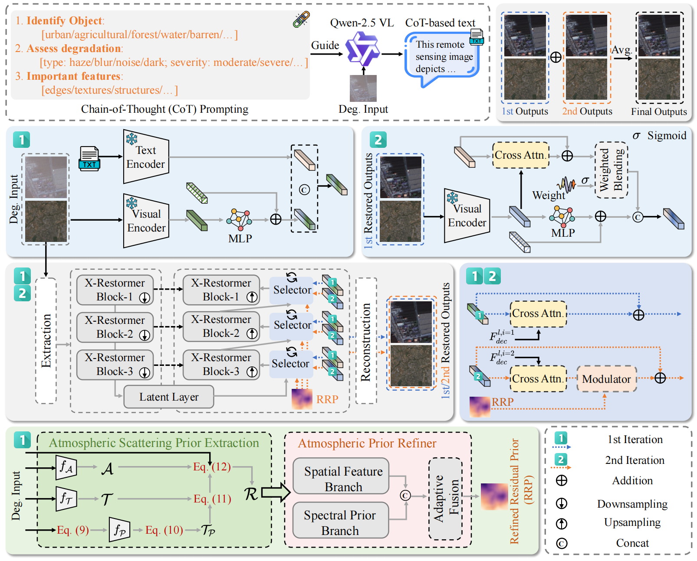

<div align="center">

## 🛰️ CogRestore: Chain-of-Thought Reasoning for All-in-One Remote Sensing Image Restoration

[](https://arxiv.org/)
[](LICENSE)
[](https://www.python.org/)
[](https://pytorch.org/)

</div>

---

This is the official PyTorch codes for the paper:

>**CogRestore: Chain-of-Thought Reasoning for All-in-One Remote Sensing Image Restoration**<br>  [Xu Zhang<sup>1</sup>](https://house-yuyu.github.io/), [Jiaqi Ma<sup>2</sup>](), [Huan Zhang<sup>3</sup>](), [Jun Wan<sup>4</sup>](), [Lefei Zhang<sup>1📧</sup>](https://scholar.google.com.hk/citations?user=BLKHwNwAAAAJ&hl=zh-CN)<br>
> <sup>1</sup>Wuhan University, <sup>2</sup>MBZUAI, <sup>3</sup>Guangdong University of Technology, <sup>4</sup>Zhongnan University of Economics and Law<br>
> <sup>📧</sup>Corresponding author.




:star: If CogRestore is helpful to your images or projects, please help star this repo. Thank you! :point_left:


## 📖 Overview

**CogRestore** is a cognitive-driven framework that introduces **Chain-of-Thought (CoT) reasoning** into All-in-One Remote Sensing Image Restoration (AiORSIR). It transforms human-like cognitive processes into structured textual descriptions and injects them as multimodal priors to guide the restoration of multiple degradation types within a single unified model.


## ✨ Highlights

- **CoT Reasoning for Restoration**: First framework to introduce chain-of-thought reasoning into RS image restoration.
- **Physical Reasoning Module**: Decomposes degradation characteristics into structured residual priors.
- **Dynamic Prompt Generator**: Fuses textual scene descriptions with physical priors into a multimodal CoT representation.
- **Iterative Coarse-to-Fine Refinement**: Two-pass mechanism that progressively eliminates artifacts under text-guided semantic constraints.


## 🔧 Installation

### Requirements

- Python >= 3.10
- PyTorch >= 2.0
- CUDA >= 11.7

### Step 1: Clone the Repository

```bash
git clone https://github.com/your-username/CogRestore.git
cd CogRestore
```

## Contact

If you have any questions, please feel free to reach us out at <a href="zhangx0802@whu.edu.cn">zhangx0802@whu.edu.cn</a>.
